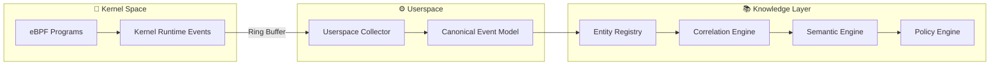
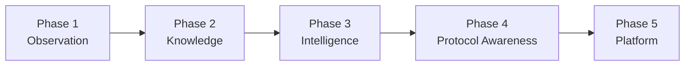

<div align="center">

# eTraceGen [IN PROGRESS]

### From Kernel Observations to System Intelligence

*A modular Linux Activity Intelligence Platform built with **eBPF** and **Modern C++20**.*

[]()
[]()
[]()
[]()
[]()
[]()

</div>

---

## Overview

Modern Linux systems generate enormous volumes of runtime telemetry. While kernel events reveal **what happened**, deriving meaningful insights requires normalization, correlation, and contextual understanding.

**eTraceGen** is a modular Linux Activity Intelligence Platform that captures kernel activity using **eBPF** and incrementally transforms low-level observations into reusable system knowledge.

Instead of treating telemetry as isolated events, eTraceGen is designed around a layered architecture where each stage adds progressively richer meaning to the data.

## Architecture
eTraceGen follows a layered architecture that separates **observation**, **knowledge construction**, and **intelligence**. Each layer has a well-defined responsibility, allowing the system to evolve without tightly coupling kernel instrumentation to higher-level analysis.

Only the observation layer interacts directly with the Linux kernel. All subsequent processing occurs in userspace, enabling richer analysis while keeping the eBPF programs lightweight and verifier-friendly.



| Layer | Responsibility |
|--------|----------------|
| **eBPF Programs** | Capture runtime kernel activity with minimal overhead. |
| **Userspace Collector** | Receive events from the kernel, validate them, and perform initial processing. |
| **Canonical Event Model** | Normalize kernel-specific events into a stable, reusable representation. |
| **Entity Registry** | Maintain state for system entities such as processes, files, sockets, and future object types. |
| **Correlation Engine** | Connect events across entities and time to reconstruct meaningful relationships. |
| **Semantic Engine** | Infer higher-level behaviors from correlated activity. |
| **Policy Engine** | Consume semantic knowledge for detection, analytics, and future policy enforcement. |

# Why eTraceGen?

The Linux ecosystem provides many excellent observability and security tools capable of capturing kernel events with **eBPF**. These tools are highly effective at collecting and exposing telemetry for debugging, monitoring, troubleshooting, and threat detection.

eTraceGen focuses on a different challenge:

> **How can raw kernel observations be transformed into reusable system knowledge?**

Rather than treating events as isolated records, eTraceGen is designed around a layered processing model where each stage adds structure, context, and meaning while remaining independent of the previous layer.

This separation enables:

- **Stable canonical events** independent of kernel-specific details
- **Reusable entity state** shared across higher-level components
- **Incremental enrichment** from observations to semantics
- **Extensible intelligence** without increasing kernel complexity

By separating **observation** from **interpretation**, eTraceGen aims to provide a reusable foundation that can support observability, security analytics, behavioural analysis, and future intelligence-driven workflows without tightly coupling those capabilities to the kernel instrumentation layer.

---

# Current Capabilities

eTraceGen currently focuses on building a reliable **observation layer** for Linux systems. The project captures runtime activity using eBPF and exports normalized event data through a modular userspace collector.

## Event Coverage

| Domain | Coverage |
|---------|----------|
| 🟢 Process | Process lifecycle (`fork`, `clone`, `exec`, `exit`) |
| 🟢 File System | File operations (`open`, `rename`, `unlink`) |
| 🟢 Syscalls | Raw syscall entry and exit tracing |
| 🟢 Network | Socket lifecycle + socket I/O (`socket`, `connect`, `accept`, `bind`, `listen`, `send*`/`recv*`, `read`/`write`, `close`, …) — compiled in and enabled by default |

## Runtime Features

- Modular eBPF instrumentation
- Userspace event collection using **libbpf**
- YAML-based runtime configuration
- NDJSON event logging
- Size-based log truncation (⚠️ delete-and-recreate at the size limit — **no backups; history at the boundary is discarded**)
- Self-observation suppression
- Verifier-friendly modular BPF programs

## Network Scope

> **Status:** the socket-layer instrumentation is **compiled into the BPF object and enabled by
> default**. It captures the full socket-first taxonomy (control plane + data plane) as metadata-only
> records — no protocol/payload inspection. This is a high-volume profile; see the noise/overhead
> notes in the [roadmap](docs/roadmap.md).

```text
Application
      │
      ▼
HTTP / HTTPS / DNS / TLS      🚧 Planned
──────────────────────────────
Socket Layer                  🟢 Active (metadata-only)
──────────────────────────────
TCP / UDP                     Kernel
──────────────────────────────
Network Stack                 Kernel
```

Protocol-aware parsing (HTTP, HTTPS, TLS, DNS) and higher-level network intelligence are planned for future development.

---

# Repository Layout

The project is organized to keep **kernel instrumentation**, **userspace processing**, and **supporting infrastructure** clearly separated.

```text
eTraceGen/
├── bpf/           # eBPF programs and kernel instrumentation
├── src/           # Userspace runtime and event processing
├── include/       # Public headers and shared interfaces
├── config/        # Runtime configuration files
├── scripts/       # Build, run, and development utilities
├── docs/          # Architecture and design documentation
├── tests/         # Unit and integration tests
├── CMakeLists.txt # Build configuration
```

## Directory Overview

| Directory | Purpose |
|-----------|---------|
| **bpf/** | eBPF programs, shared helpers, maps, and kernel event instrumentation. |
| **src/** | Userspace collector, event processing pipeline, logging, configuration, and future intelligence components. |
| **include/** | Shared data structures, interfaces, utilities, and common headers. |
| **config/** | YAML configuration files controlling runtime behaviour. |
| **scripts/** | Helper scripts for building, running, cleaning, and development workflows. |
| **docs/** | Architecture, design decisions, development notes, and roadmap documentation. |
| **tests/** | Unit tests, integration tests, and future validation suites. |

> **Design Principle**
>
> Kernel-space code is intentionally isolated from userspace logic to keep eBPF programs lightweight, verifier-friendly, and focused solely on observation.

---

# Requirements

eTraceGen currently targets modern Linux distributions with **eBPF** and **BTF** support.

## Build Dependencies

| Dependency | Purpose |
|------------|---------|
| Linux Kernel | eBPF runtime support |
| clang / LLVM | Compile eBPF programs |
| libbpf | Userspace eBPF library |
| bpftool | Generate BTF and skeletons |
| CMake | Build system |
| C++20 Compiler | Build userspace components |

Expected BTF location:

```text
/sys/kernel/btf/vmlinux
```

---

# Quick Start

## Clone

```bash
git clone https://github.com/bhanuprakasheagala/eTraceGen.git
cd eTraceGen
```

## Build

```bash
cmake -S . -B build
cmake --build build -j
```

## Build eBPF Programs

```bash
./scripts/linux.sh bpf
```

## Run

```bash
sudo ./scripts/linux.sh run
```

## Available Commands

```bash
./scripts/linux.sh help
```

- `./scripts/linux.sh build`
- `./scripts/linux.sh bpf`
- `./scripts/linux.sh all`
- `./scripts/linux.sh check`
- `./scripts/linux.sh preflight`
- `./scripts/linux.sh smoke`
- `./scripts/linux.sh validate`
- `./scripts/linux.sh verify`
- `./scripts/linux.sh run`


---

# Runtime Configuration

Runtime behaviour is configured using YAML.

Example:

```yaml
sink:
  path: /var/log/etracegen/events.ndjson
  max_file_size_bytes: 104857600

domains:
  process: true
  file: true
  syscall: true
  network_socket: true
```

Default behaviour:

- Capture-first event collection
- NDJSON event logging
- Automatic log rotation
- Collector self-observation suppression

---

# Roadmap

eTraceGen is being developed incrementally, with each phase building on the previous one. The focus is to establish a solid observation foundation before introducing higher-level intelligence.



| Phase | Objectives | Status |
|-------|------------|--------|
| **Phase 1 – Observation** | eBPF instrumentation, userspace collector, runtime configuration, process/file/syscall/socket telemetry | 🚧 In Progress |
| **Phase 2 – Knowledge** | Canonical event model, entity registry, event correlation, state management | 📋 Planned |
| **Phase 3 – Intelligence** | Semantic analysis, behaviour modelling, policy engine | 📋 Planned |
| **Phase 4 – Protocol Awareness** | HTTP, TLS, DNS and application-layer protocol intelligence | 📋 Planned |
| **Phase 5 – Platform** | Knowledge graph, analytics, plugin framework, extensibility | 📋 Planned |

> **Project Philosophy**
>
> Each phase delivers a usable foundation while preserving a clear separation between **observation**, **knowledge construction**, and **intelligence**.


