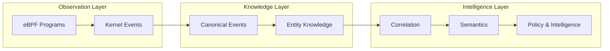

# eTraceGen [IN PROGRESS]

### From Kernel Facts to System Knowledge

*A modular Linux Activity Intelligence Platform built with **eBPF** and **Modern C++20**.*

---

## Overview

Modern Linux systems generate enormous volumes of runtime telemetry. While kernel events reveal **what happened**, deriving meaningful insights requires normalization, correlation, and contextual understanding.

**eTraceGen** is a modular Linux Activity Intelligence Platform that captures kernel activity using **eBPF** and incrementally transforms low-level observations into reusable system knowledge.

Instead of treating telemetry as isolated events, eTraceGen is designed around a layered architecture where each stage adds progressively richer meaning to the data.

The long-term vision is to evolve from **kernel event collection** into a reusable platform capable of understanding system activity, reconstructing relationships, and enabling higher-level behavioural analysis.

> **Current Focus**
>
> Phase 1 establishes a robust observation layer by collecting kernel events, normalizing them into canonical representations, and building the foundation for future correlation and semantic analysis.
